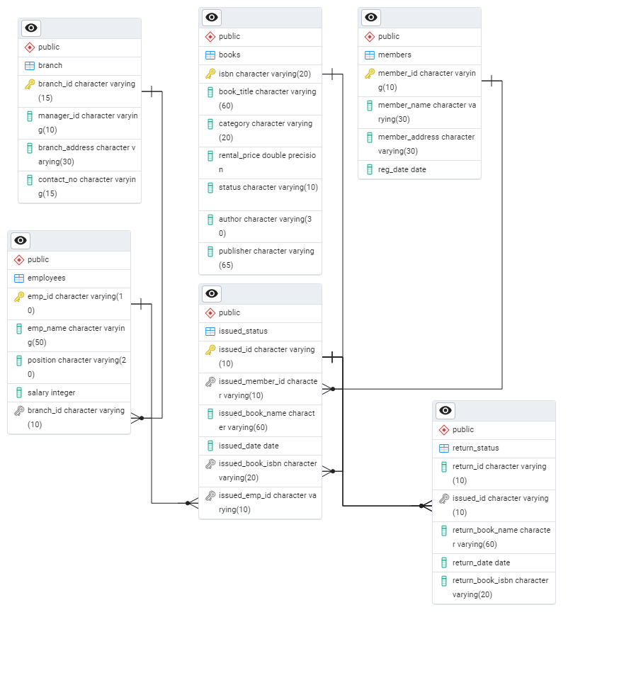
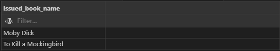
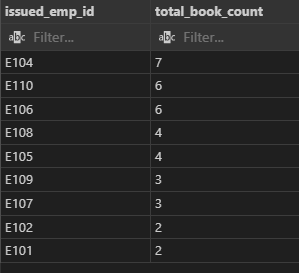
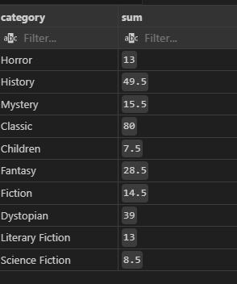
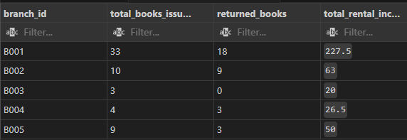
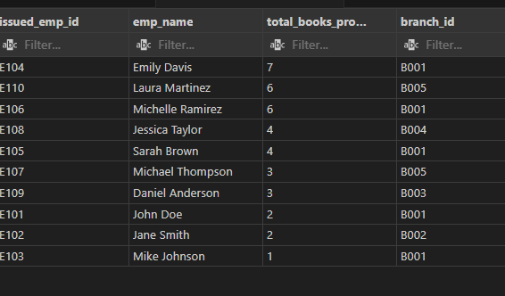

# Introduction
For this analysis, the aim is to analyse library data for different libraries located at different locations. I aim to gain insights such as total issued books, books overdue, total fines and so on.

# Background
The source of the data set is (https://github.com/najirh/Library-System-Management---P2 1:1). 

It conatsins tables: books, branch, employees, issued_status, members and return_status.

### The questions and tasks I wanted to ask through my SQL queries were :
1. Create a New Book Record
'978-1-60129-456-2', 'To Kill a Mockingbird', 'Classic', 6.00, 'yes', 'Harper Lee', 'J.B.    Lippincott & Co.'

2.  Update an Existing Member's Address

3. Delete a Record from the Issued Status Table
Objective: Delete the record with issued_id = 'IS104' from the issued_status table.

4. Retrieve All Books Issued by a Specific Employee
Objective: Select all books issued by the employee with emp_id = 'E101'.

5. List Members Who Have Issued More Than One Book
 Objective: Use GROUP BY to find members who have issued more than one book.

6. Create Summary Tables**: Use CTAS to generate new tables based on query results - each book and total book_issued_count.

7. Retrieve All Books in a Specific Category.

8. Find Total Rental Income by Category.

9. List Members Who Registered in 2021.

10. List Employees with Their Branch Manager's Name and their branch details.

11.  Create a Table of Books with Rental Price Above a Certain Threshold.

12. Retrieve the List of Books Not Yet Returned.

13. Identify Members with Overdue Books
Write a query to identify members who have overdue books (assume a 360-day return period). Display the member's name, book title, issue date, and days overdue.

14. Branch Performance Report
Create a query that generates a performance report for each branch, showing the number of books issued, the number of books returned, and the total revenue generated from book rentals.

15. CTAS: Create a Table of Active Members
Use the CREATE TABLE AS (CTAS) statement to create a new table active_members containing members who have issued at least one book in the last 1 year.

16. Find Employees with the Most Book Issues Processed
Write a query to find the top 3 employees who have processed the most book issues. Display the employee name, number of books processed, and their branch.    

17. Create Table As Select (CTAS)
Objective: Create a CTAS (Create Table As Select) query to identify overdue books and calculate fines.

    Description: Write a CTAS query to create a new table that lists each member and the books they have issued but not returned within 30 days. The table should include:
    The number of overdue books.
    The total fines, with each day's fine calculated at $0.50.
    The number of books issued by each member.
    The resulting table should show:
    Member ID
    Number of overdue books
    Total fines
18. Update Book Status on Return
 Write a query to update the status of books in the books table to "available" when they are returned (based on entries in the return_status table).

19. Stored Procedure
Objective: Create a stored procedure to manage the status of books in a library system.
Description: Write a stored procedure that updates the status of a book based on its issuance or return. Specifically:
If a book is issued, the status should change to 'no'.
If a book is returned, the status should change to 'yes'.

# Tools I used
- **SQL** - Used to query the databse
- **PostgreSQL** - Database Mangement System (DBMS) used and to generate entity relationship diagram (ERD)
- **Visual Studio Code** - For database management and executing SQL queries
- **Git and Github** - For version control and ensuring collaborations

# Data Modelling
This is establishing relationships between the different tables, assigning primary keys, foreign keys and generating entity relationship diagram. This was done using postgresql.



# Analysis
### 1. Create a New Book Record'978-1-60129-456-2',  'To Kill a Mockingbird', 'Classic', 6.00, 'yes', 'Harper Lee', 'J.B.    Lippincott & Co.'
```sql
INSERT INTO books (isbn, book_title, category, rental_price, status, author, publisher)
VALUES ('978-1-60129-456-2', 'To Kill a Mockingbird', 'Classic', 6.00, 'yes', 'Harper Lee', 'J.B. Lippincott & Co.');
```

### 2.  Update an Existing Member's Address
```sql
UPDATE members
SET member_address='135 Pine St'
WHERE member_id='C118';
```

### 3. Delete a Record from the Issued Status Table
Objective: Delete the record with issued_id = 'IS104' from the issued_status table.
```sql
DELETE FROM issued_status
WHERE issued_id = 'IS104';
```

### 4. Retrieve All Books Issued by a Specific Employee.
 Objective: Select all books issued by the employee with emp_id = 'E101'.

```sql
SELECT issued_book_name
FROM issued_status
WHERE issued_emp_id = 'E101';
```


### 5. List Members Who Have Issued More Than One Book
 Objective: Use GROUP BY to find members who have issued more than one book.
 HAVING lets me give a condition for only employees who have issued more than one book to be displayed.

 ```sql
 SELECT issued_emp_id,
       COUNT(issued_id) AS total_book_count
FROM issued_status
GROUP BY issued_emp_id
HAVING COUNT(issued_id)> 1
ORDER BY total_book_count DESC;
```


### 6. Create Summary Tables**: Use CTAS to generate new tables based on query results - each book and total book_issued_count.
```sql
CREATE TABLE issued_books_count AS(
    SELECT books.isbn,
       books.book_title,
       COUNT(issued_status.issued_id) AS issue_count
FROM books
LEFT JOIN issued_status ON books.isbn = issued_status.issued_book_isbn
GROUP BY books.isbn, books.book_title
ORDER BY issue_count DESC
);
```
### 7. Retrieve All Books in a Specific Category.
Retrieved all the books that fall under the cateory named Dystopian.
```sql
SELECT book_title
FROM books
WHERE category = 'Dystopian';
```
### 8. Find Total Rental Income by Category.
```sql
 SELECT category,
          SUM(rental_price)
FROM books
LEFT JOIN issued_status ON books.isbn = issued_status.issued_book_isbn
GROUP BY category;
```


History category grossed the most rental income while children category grossed the least.

### 9. List Members Who Registered in 2021.
I used the EXTRACT method and the year function to get members registered in 2021.
```sql
SELECT *
FROM members
WHERE EXTRACT(YEAR FROM reg_date) = 2021;
```
### 10. List Employees with Their Branch Manager's Name and their branch details.
```sql
SELECT *
FROM employees AS emp
INNER JOIN branch AS br ON emp.branch_id = br.branch_id
JOIN employees AS e ON br.manager_id = e.emp_id;
```
### 11.  Create a Table of Books with Rental Price Above a Certain Threshold.
I created a table named pricy_books using CTA that contained all books with a rental price above $5.I used the WHERE clause to meet the conditon.
```sql
CREATE TABLE  pricy_books AS(
    SELECT *
FROM books
WHERE rental_price > 5
);
```

### 12. Retrieve the List of Books Not Yet Returned.
```sql
SELECT *
FROM issued_status
LEFT JOIN return_status ON issued_status.issued_id = return_status.issued_id
WHERE return_id IS NULL;
```
### 13. Identify Members with Overdue Books
Write a query to identify members who have overdue books (assume a 360-day return period). Display the member's name, book title, issue date, and days overdue.
```sql
SELECT member_name,
       book_title,
       issued_date,
       CURRENT_DATE - issued_date AS days_overdue
FROM issued_status
LEFT JOIN return_status ON issued_status.issued_id = return_status.issued_id
LEFT JOIN books ON issued_status.issued_book_isbn = books.isbn
LEFT JOIN members ON issued_status.issued_member_id = members.member_id
WHERE return_id IS NULL
AND (CURRENT_DATE - issued_date) > 360;
```
### 14. Branch Performance Report
Create a query that generates a performance report for each branch, showing the number of books issued, the number of books returned, and the total revenue generated from book rentals.
```sql
SELECT branch.branch_id,
       COUNT(is1.issued_id) AS total_books_issued,
        COUNT(return_id) AS returned_books,
       SUM(books.rental_price) AS total_rental_income
FROM branch
LEFT JOIN employees ON branch.branch_id = employees.branch_id
LEFT JOIN issued_status ON employees.emp_id = issued_status.issued_emp_id 
LEFT JOIN books ON books.isbn = issued_status.issued_book_isbn
LEFT JOIN issued_status AS is1 ON books.isbn = is1.issued_book_isbn
LEFT JOIN return_status ON is1.issued_id = return_status.issued_id
GROUP BY branch.branch_id
ORDER BY branch_id ASC;
```


### 15. CTAS: Create a Table of Active Members
Use the CREATE TABLE AS (CTAS) statement to create a new table active_members containing members who have issued at least one book in the last 1 year.
```sql
CREATE TABLE active_members AS(
    SELECT issued_status.issued_id,
       issued_status.issued_member_id,
       issued_status.issued_book_name,
       issued_status.issued_date,
       members.member_name
FROM issued_status
LEFT JOIN members ON issued_status.issued_member_id = members.member_id
WHERE issued_date > CURRENT_DATE - INTERVAL '1 year'
);
```
### 16. Find Employees with the Most Book Issues Processed
Write a query to find the top 3 employees who have processed the most book issues. Display the employee name, number of books processed, and their branch.
```sql
SELECT issued_emp_id,
       emp_name,
       COUNT(issued_id) AS total_books_processed,
       branch.branch_id,
       branch_address
FROM issued_status
LEFT JOIN employees ON issued_status.issued_emp_id = employees.emp_id
LEFT JOIN branch ON employees.branch_id = branch.branch_id
WHERE issued_emp_id IS NOT NULL
GROUP BY issued_emp_id, emp_name, branch.branch_id, branch_address
ORDER BY total_books_processed DESC;
```


### 17. Create Table As Select (CTAS)
Objective: Create a CTAS (Create Table As Select) query to identify overdue books and calculate fines.

Description: Write a CTAS query to create a new table that lists each member and the books they have issued but not returned within 360 days. The table should include:
    The number of overdue books.
    The total fines, with each day's fine calculated at $0.50.
    The number of books issued by each member.
    The resulting table should show:
    Member ID
    Number of overdue books
    Total fines

```sql
 CREATE TABLE fines_summary AS(
     SELECT member_id,
       SUM((CURRENT_DATE - issued_date))AS days_overdue,
      SUM((CURRENT_DATE - issued_date)*0.50) AS total_fine
FROM issued_status
LEFT JOIN return_status ON issued_status.issued_id = return_status.issued_id
LEFT JOIN books ON issued_status.issued_book_isbn = books.isbn
LEFT JOIN members ON issued_status.issued_member_id = members.member_id
WHERE return_id IS NULL
AND (CURRENT_DATE - issued_date) > 360
GROUP BY member_id
   );
```
### 18. Update Book Status on Return
 Write a query to update the status of books in the books table to "available" when they are returned (based on entries in the return_status table).
 
 Use stored procedures.
```sql
 CREATE OR REPLACE PROCEDURE update_book_status(p_return_id VARCHAR(10), p_issued_id VARCHAR (10))
LANGUAGE plpgsql
AS $$
DECLARE
v_isbn VARCHAR(20);
v_book_name VARCHAR(20);

BEGIN
INSERT INTO return_status(return_id, issued_id, return_date)
VALUES (p_return_id,p_issued_id, CURRENT_DATE);

SELECT issued_book_isbn,
       issued_book_name
INTO v_isbn
     v_book_name
FROM issued_status
WHERE issued_id=p_issued_id;

UPDATE books
SET status = 'yes'
WHERE isbn =v_isbn;

RAISE NOTICE 'Book returned title: %', v_book_name;


END;
$$;

CALL update_book_status('RS119','IS136');
```
### 19. Stored Procedure
Objective: Create a stored procedure to manage the status of books in a library system.
Description: Write a stored procedure that updates the status of a book based on its issuance or return. Specifically:
If a book is issued, the status should change to 'no'.
If a book is returned, the status should change to 'yes'.

```sql
CREATE OR REPLACE PROCEDURE manage_book_status(p_issued_id VARCHAR(10), p_issued_member_id VARCHAR(10), p_issued_book_isbn VARCHAR(20), p_issued_emp_id VARCHAR(10))
LANGUAGE plpgsql
AS $$
DECLARE
v_status VARCHAR(10);
BEGIN

SELECT status
INTO 
v_status
FROM books
WHERE isbn = p_issued_book_isbn;


IF v_status = 'yes' THEN
 INSERT INTO issued_status(issued_id, issued_member_id, issued_date, issued_book_isbn, issued_emp_id)
 VALUES(p_issued_id, p_issued_member_id, CURRENT_DATE, p_issued_book_isbn, p_issued_emp_id);

 UPDATE books
 SET status='no'
 WHERE isbn = p_issued_book_isbn;

 RAISE NOTICE 'Successfully uploaded book: %', p_issued_book_isbn;

ELSE
 RAISE NOTICE 'Sorry, book unavailable book isbn: %', p_issued_book_isbn;

 END IF;

END;
$$;

CALL manage_book_status('IS142', 'C110', '978-0-307-58837-1', 'E104');
```
# Lessons Learnt
I learnt a new concept, creating stored procedures.
I also improved on the concepts I already knew such as CRUD operations, JOINS and CTAs.
